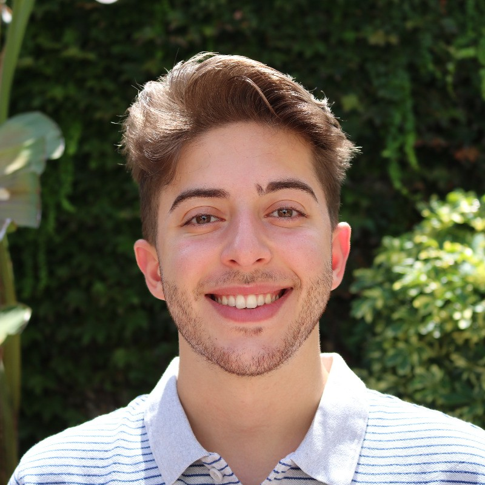

## About Me

Hi! I am a Data Science MSc. from the University of Buenos Aires (UBA).

I am currently an AI Safety Researcher at the Institute of Computing Sciences, UBA. I am thankful to be funded by the [AISAR](https://aisafety.ar) Open Philanthropy program. Recently, my research revolves around safer deployment methods against biases for medical LLMs.

In another life, I worked as a tech consultant in [ZS Associates](https://www.zs.com/solutions/life-sciences-randd-and-medical) for 2+ years.

In my copious free time, I moderate Wikipedia and contribute to reducing the english-spanish language resource gap. Being a trumpet player, I enjoy jazz music.

# Select experience

- Research Fellow, Cambridge Artificial Intelligence Safety Hub (CAISH), MARS - 2025
- Research Fellow, Artificial Intelligence Safety Argentina (AISAR), Open Philanthropy - 2025
- Honor Diploma (MSc.), University of Buenos Aires - 2024
- Certified Bartender, Gato Dumas - 2023
- Student Volunteer @ XXI Latin Ibero-American Conference in Operations Research - 2022
- Iberoamerican Mathematics Olympiad, Participant - 2017
- Argentine Mathematics Olympiad, Gold Medal - 2016
